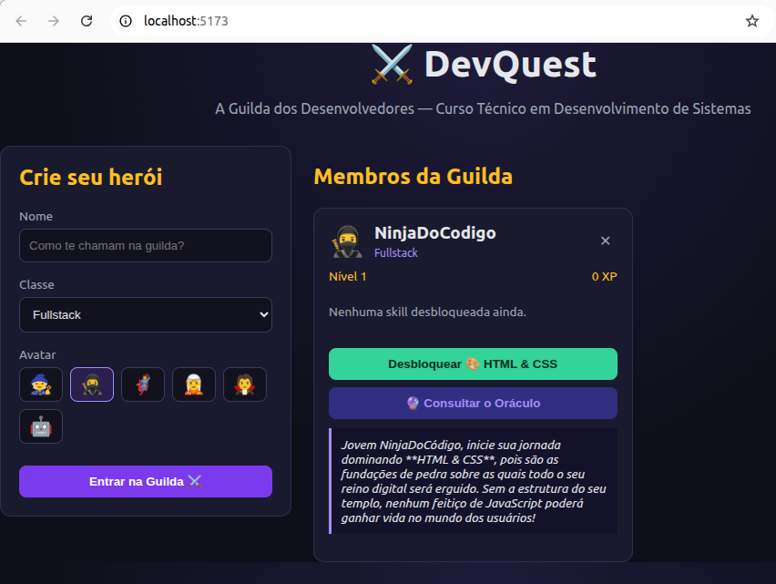

# ⚔️ DevQuest — A Guilda dos Desenvolvedores - Front-End

Projeto exemplo para apresentação aos ingressos do **Curso Técnico em
Desenvolvimento de Sistemas**. O objetivo é mostrar, o conjunto de tecnologias que vão usar ao longo da formação:

- **Node.js + Express** → back-end / API REST [ver repositório do projeto](https://github.com/fabiosperotto/devquest-backend)
- **Sequelize** → ORM (comunicação com o banco de dados)
- **MySQL** → banco de dados relacional
- **React (Vite)** → front-end

## O tema




O usuário cria um **Herói** (seu avatar de desenvolvedor) e vai **desbloqueando Skills** — que são, na prática, as disciplinas e tecnologias do curso (HTML/CSS, JavaScript, React, Node, MySQL, Sequelize, Segurança, Git...). Cada skill desbloqueada dá XP e sobe de nível. Existe também um **🔮 Oráculo**, que hoje dá dicas offline (sem IA) mas já está pronto como ponto de extensão para você plugar uma IA de verdade na apresentação (veja a seção final).


## Estrutura do projeto

```
└── devquest-frontend/       # SPA em React (Vite)
    └── src/
        ├── api/api.js       # chamadas fetch para a API
        ├── components/      # HeroForm, HeroCard
        └── App.jsx
```


## Pré-requisitos

- [Node.js 18+ e npm](https://nodejs.org/)
- Um editor de código (recomendado: [VS Code](https://code.visualstudio.com/))
- O [back-end](https://github.com/fabiosperotto/devquest-backend) com a configuração pronta e servidor executando.


## Passo a passo

1. Back-end em execução

2. Fork no repositório

3. Clonar o repositório:
   ```bash
   git clone https://github.com/seu_usuario/devquest-frontend.git
   ```

4. Acesse a pasta do projeto no terminal:
   ```bash
   cd devquest-frontend
   ```

5. Instale as dependências:
   ```bash
   npm install
   ```

6. Suba o servidor de desenvolvimento:
   ```bash
   npm run dev
   ```

7. Acesse no navegador: [http://localhost:5173](http://localhost:5173)


## Como contribuir
Faça um fork do projeto. Crie uma branch e realize as suas contribuições. É obrigatório usar [Conventional Commits](https://www.conventionalcommits.org/en/v1.0.0/) nas descrições dos commits. Depois faça um pull request que será analisado. Não serão aceitos contribuições diretamente na branch main.


## Créditos e referências

- Estrutura de API inspirada no material didático
  [`api-players-express`](https://github.com/fabiosperotto/api-players-express)
  (Node + Express + Sequelize + MySQL).

